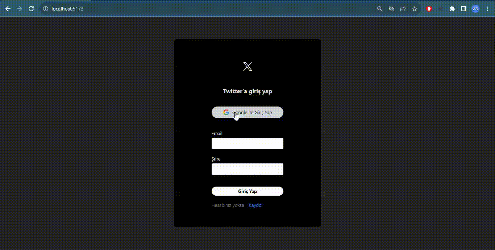

# Firebase Twitter

- Twitter clone project was created using firebase

## USED

- react
- react-router-dom
- FIREBASE/FIRESTORE
- react-icons
- react-toastify
- uuid
- moment
- useEffect, useState
- tailwindcss

### Deploy

[[https://](https://x-clone-ilkhukuk.netlify.app/)](https://x-clone-ilkhukuk.netlify.app/)

## Contact

- https://github.com/ilkhukuk
- ilkhukuk@gmail.com

### Screen

